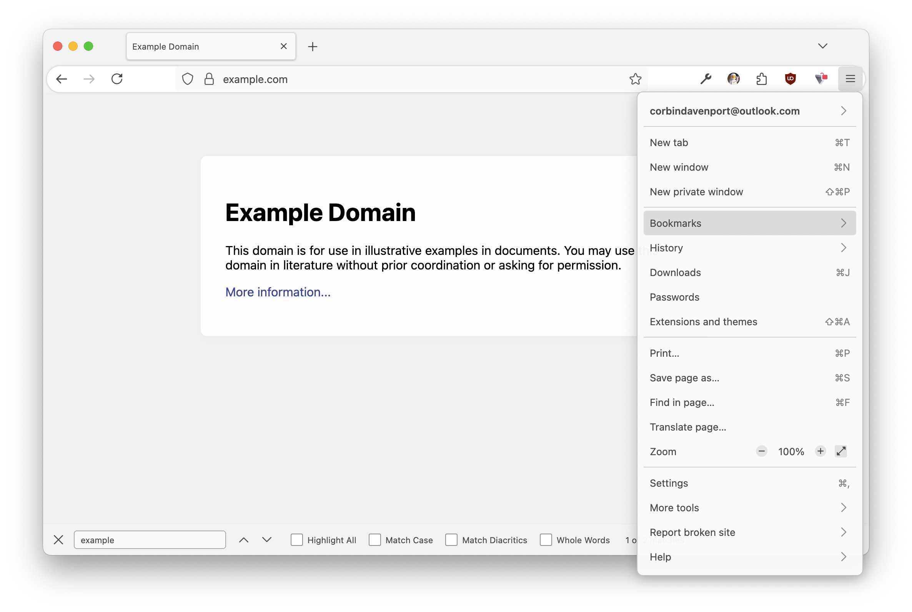
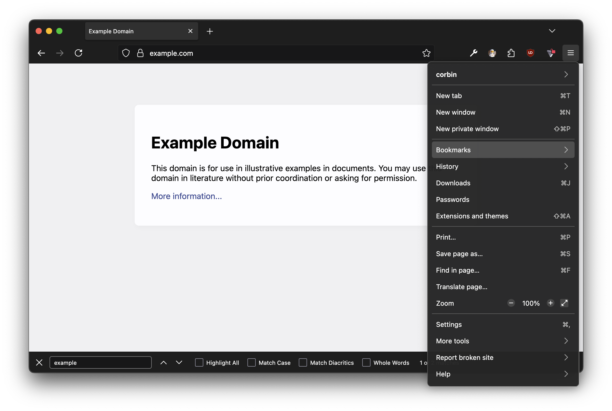

# Cupertino

Cupertino is a theme for the Mozilla Firefox browser designed to match the macOS color scheme and design. It provides a more native look and feel for Firefox on Mac computers, with a curved toolbar and colors based on Finder and Safari. Cupertino supports both light and dark modes.

[**Download for Firefox**](https://addons.mozilla.org/en-US/firefox/addon/cupertino-theme/) | [**Get previous version**](https://github.com/corbindavenport/cupertino/releases/tag/v1.0)

The developers of this theme are not associated with Mozilla or Apple, inc.