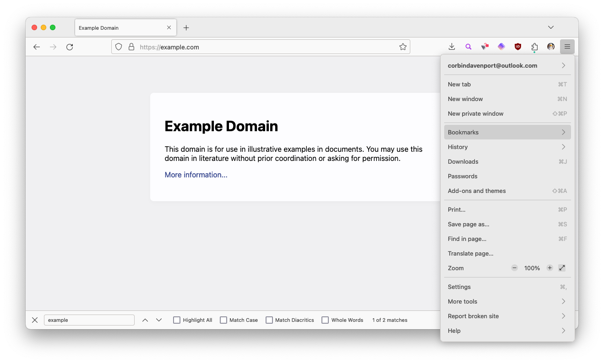

# Cupertino

Cupertino is a theme for the Mozilla Firefox browser designed to match the macOS color scheme and design. It provides a slightly more native look and feel for Firefox on Mac computers, inspired by the design of Apple Safari, and it supports both light and dark modes.

[**Download for Firefox**](https://addons.mozilla.org/en-US/firefox/addon/cupertino-theme/)

The developers of this theme are not associated with Mozilla or Apple, inc.