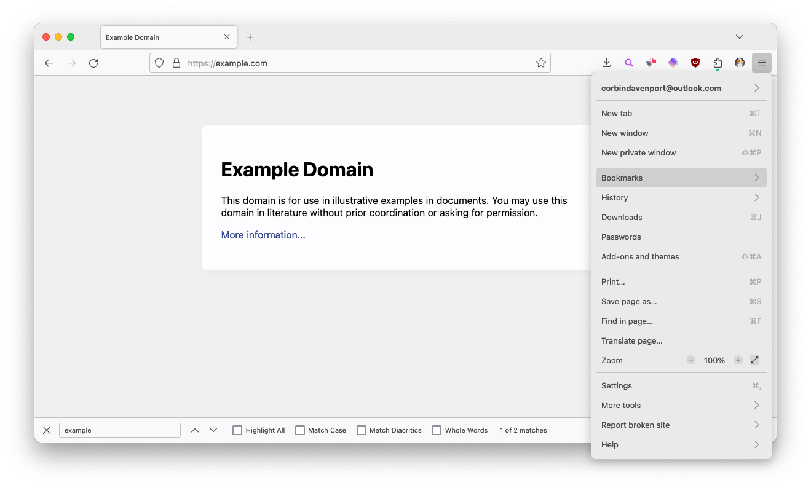
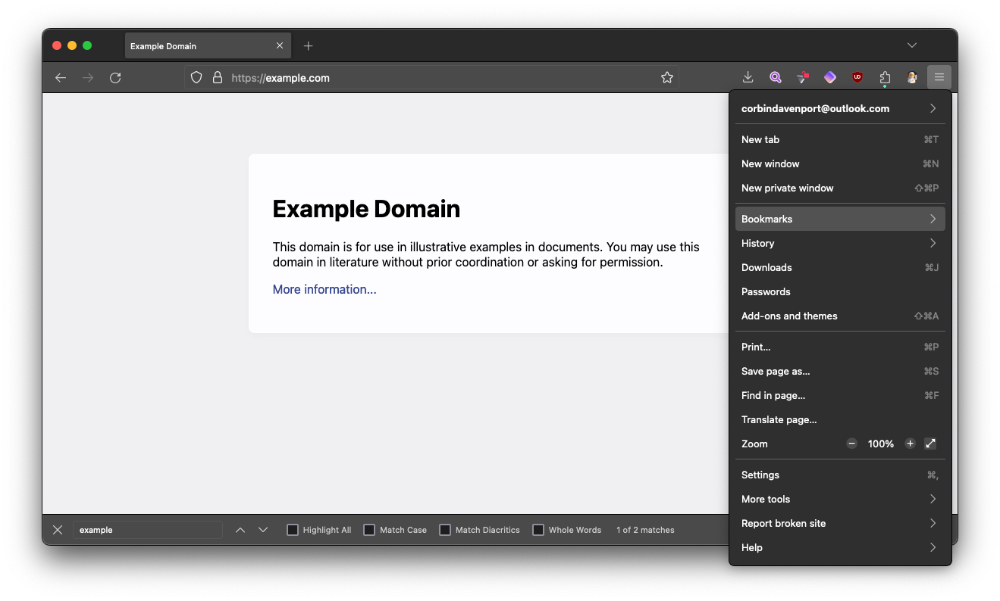

# Cupertino

Cupertino is a theme for the Mozilla Firefox browser designed to match the macOS color scheme and design. It provides a more native look and feel for Firefox on Mac computers, with a curved toolbar and colors based on Finder and Safari. Cupertino supports both light and dark modes.

[**Download for Firefox**](https://addons.mozilla.org/en-US/firefox/addon/cupertino-theme/) | [**Get previous version**](https://addons.mozilla.org/en-US/firefox/addon/cupertino-sequoia/)





The developers of this theme are not associated with Mozilla or Apple, inc.

## Development information

This theme is compiled with a PowerShell script, allowing for the use of variables, comments, and other features not available when writing directly in JSON.

You need to [install PowerShell 7](https://learn.microsoft.com/en-us/powershell/scripting/install/install-powershell?view=powershell-7.6), then run the script:

```
pwsh ./build.ps1
```

This will create a `/build/firefox` directory containing the compiled theme. To test the theme, open `about:debugging#/runtime/this-firefox` in Firefox, click the "Load Temporary Add-on" button, and select the `manifest.json` file in the new directory.

To create a ZIP file for submission to Firefox Add-ons, run this:

```
pwsh ./build.ps1 -MakeZip
```